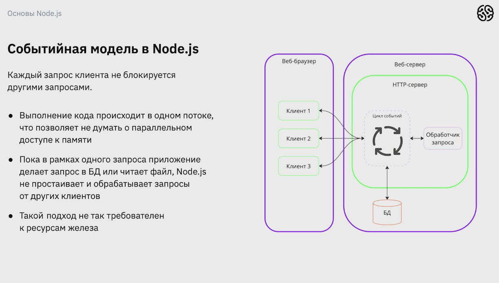

# Node.js

## Создание отдельных процессов

* Удобно с точки зрения проектирования и программирования
* Создание отдельных процессов на запрос тербует относительно много ресурсов

## Создание отдельного потока

* Требует особого внимания к работе  с общими данными, так как два паралено запущенных потока могут изменять общие ресурсы.

* Менее требовательный к ресурсам железа подход, чем создание отдельных процкссов.

## Событийная модель в Node.js

* Выполнение кода происходит в одном потоке, что позволяет не думать о паралельном доступе к памяти.

* Пока в рамках одного запроса приложение делает запрос в БД или читает фаил, Node.js не простраивает и обрабатывает запросы от других клиентов

* Такой подход не так требователен к ресурсам железа.

### Из чего состоит Node.js?

* V8 - JS движок или интерпритатор JS
* libUV - Библиотека, которая осуществляет Node.js ассинхронный ввод-вывод. Аналог WebAPI в браузере
* NPM - пакетный менеджер. Позволяет скачивать и устанавливать различные библиотеки.

### Контекст выполнения в V8

__Контекст выполнения__ - *это механизм позволяющий интерпритатору понимать, какие переменные и функции доступны для использования в текущий момент.*

* __Глобальный контекст__ - этот контекст выполняется при запуске скрипта. В этот контекст записывается все переменные и функции, которые мы определим.

* __Контекст функции__ - этот контекст создается во время вызова фунции и в этот контекст и в этот контекст записываются переменные и функции, которые были определены в нутри исходной функции.

## Асинхронность в Node.js

# Введение в NPM

(лекция 2)

__NPM__ - это пакетный менеджер.

* Для установки билиотеки достаточно выполнить команду:

 npm install *имя_библиотеки*
 npm -v проверка установленной версии NPM
 npm init -y - инициализация проекта NPM
 npm install uuid - uuid библиотека для  создания уникальных id строк.

## Для чего нужна директория node_modules?

__node_modules__ - это каталог в вашем проекте npm, в котором хрантся все установленные пакеты и и их зависимости.

Когда мы устанавливаем пакет с помощью NPM, он скачивается из npm registry и код пакета размещается в каталоге node_modules.

### Установка зависимостей

Есть два способа установки зависимостей проекта:

* __npm install__ - устанвливает все зависимости, которые указаны в package.json, а также обновляет пакетны

* __npm ci__ - также устанавливает все зависимости, при этом пакеты не обновляются.

### Удаление пакетов

Есть два способа удаления пакетов из проекта:

* __npm unistall <имя_пакетов>__ - удаляет код указанного пакета из node_modules, а также упоминание этого пакета в package.json

* Также можно удалить в package.json сктроку с названием и версией пакета, а затем запустить команду npm ci или npm install.

### Чем отличается dependncies от devDependencies

__dependenciees__ - это зависимости, которые необходимы для работы вашего когда в продакшене. Установка пакетов осуществляется с помощью npm install <имя_пакета>

__devDependecies__ - это зависимости, которые необходимы только для разработки вашего кода. Установка осуществляется с помощью  npm install -D <имя_пакета>.

__Удалить пакеты devDependencies можно командой npm unistall <имя_пакета>.__

### Подготавливаем проект

1. Инициализируем проект NPM
2. Написание кода проекта
3. Написание файла README.md
4. Указание стартового файла проекта в package.json
5. Добавление опиcания проекта в package.json

#### Для инициализации на npmjs.com в терминале вводим команду __npm login__ 

Для публикации своего пакета используется команда __npm publish__.

## Правила семантического версионирования 

Версии пакетов состоят из трех цифр. Например 2.3.8

* Первая цифра - major. Изменяется, когда в проекте реализованы обратно несовместиые изменения

* Вторая цифра - minor. Изменяется, когда в проекте добавился функционал и при этом сохранена обратная совместимость

* Третья цифра - path. Изменяется, когда в проекте исправлены ошибки и баги и при этом сохраняется обратная совместимость. 

# Модули и фрейворк Express (WIP)

